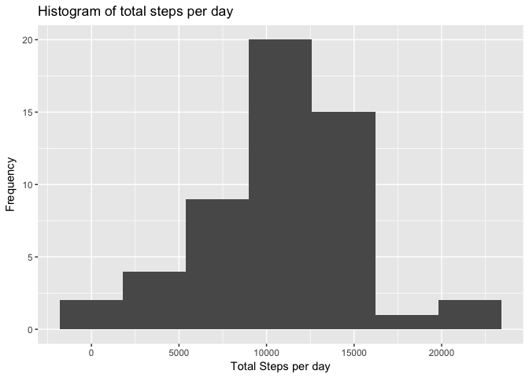
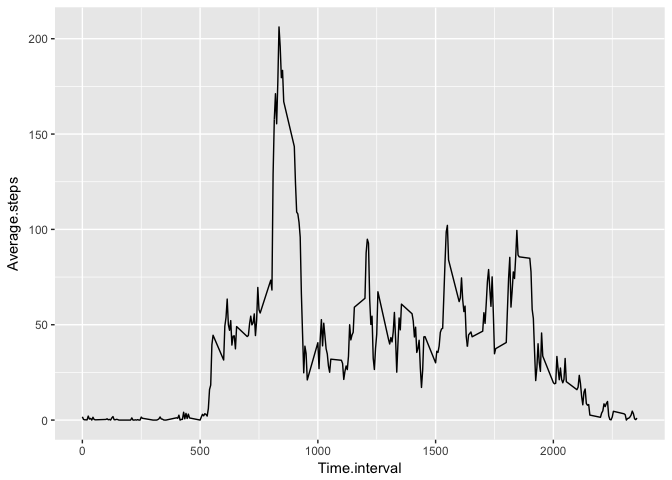
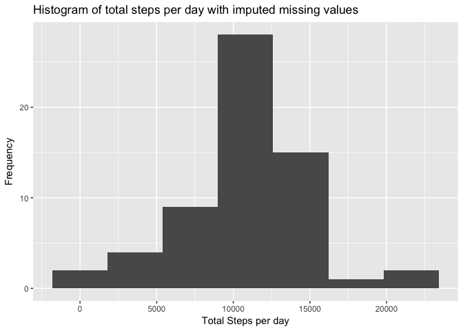
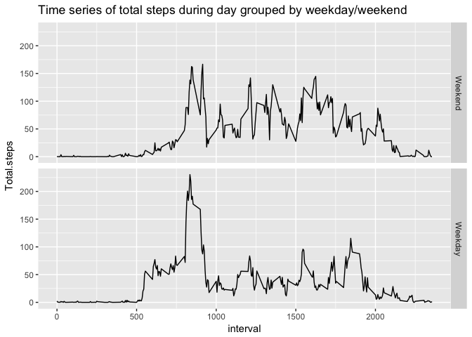

## Loading and preprocessing the data
Q:Show any code that is needed to
Load the data (i.e. read.csv())
Process/transform the data (if necessary) into a format suitable for your analysis

A: Code chunk is pasted below.User can change working directory in the first command. 
This code uses the data directly off of repository rather than individual github sources but fileurl can be changed to any suitable location. 
Code chunk downloads file, unzips and removes parent zip file and then loads raw csv data into a data-frame ready for further analysis


```r
setwd("~/coursera/Rep-rez/")
knitr::opts_chunk$set(echo = TRUE, results = "asis", fig.path = "instructions_fig/", warning = FALSE, message = FALSE)


require(ggplot2)
require(timeDate)

fileurl <- "https://d396qusza40orc.cloudfront.net/repdata%2Fdata%2Factivity.zip"

if (!file.exists("./activity.csv"))
{
        download.file(fileurl, destfile = "./activity.zip", method = "curl")
        unzip("./activity.zip")
        file.remove("./activity.zip")
}

activitydf <- read.csv("./activity.csv",header=TRUE)
```

## What is mean total number of steps taken per day?
For this part of the assignment, you can ignore the missing values in the dataset.

Calculate the total number of steps taken per day
If you do not understand the difference between a histogram and a barplot, research the difference between them. Make a histogram of the total number of steps taken each day


```r
Stepssumbydate<-
        aggregate(activitydf$steps, by = list(activitydf$date), sum)
names(Stepssumbydate) <- c("Date","Total.steps")

gr <- ggplot(Stepssumbydate, aes(Total.steps, na.rm = TRUE)) +
        geom_histogram(binwidth = 3600) +
        xlab("Total Steps per day") +
        ylab("Frequency") +
        ggtitle("Histogram of total steps per day")
gr
```

<!-- -->

Q: Calculate and report the mean and median of the total number of steps taken per day


```r
print("Average steps per day")
```

[1] "Average steps per day"

```r
mean(Stepssumbydate$Total.steps,na.rm=TRUE)
```

[1] 10766.19

```r
print("Median steps per day")
```

[1] "Median steps per day"

```r
median(Stepssumbydate$Total.steps,na.rm=TRUE)
```

[1] 10765

## What is the average daily activity pattern?
Q: Make a time series plot (i.e. type = "l" ) of the 5-minute interval (x-axis) and the average number of steps taken, averaged across all days (y-axis)


```r
Avgstepsbytime <- aggregate(activitydf$steps, by=list(activitydf$interval),
                            mean,na.rm=TRUE)
names(Avgstepsbytime) <- c("Time.interval","Average.steps")

gr1 <- ggplot(Avgstepsbytime,aes(x=Time.interval,y=Average.steps)) + 
        geom_line()
gr1
```

<!-- -->

Which 5-minute interval, on average across all the days in the dataset, contains the maximum number of steps?

```r
maxint <- Avgstepsbytime$Time.interval[which.max(Avgstepsbytime$Average.steps)]
Avgstepsbytime[(Avgstepsbytime$Time.interval==maxint),]
```

    Time.interval Average.steps
104           835      206.1698
A: The max steps taken on average are at time interval 835 seconds with a step count of 206 steps

## Imputing missing values
Note that there are a number of days/intervals where there are missing values (coded as NA). The presence of missing days may introduce bias into some calculations or summaries of the data.

Q: Calculate and report the total number of missing values in the dataset (i.e. the total number of rows with NAs)
A: 

```r
print("Number of missing rows")
```

[1] "Number of missing rows"

```r
sum(is.na(activitydf$steps))
```

[1] 2304

```r
print("Percentage of missing rows")
```

[1] "Percentage of missing rows"

```r
round(mean(is.na(activitydf$steps))*100,1)
```

[1] 13.1

Q: Devise a strategy for filling in all of the missing values in the dataset. The strategy does not need to be sophisticated. For example, you could use the mean/median for that day, or the mean for that 5-minute interval, etc.
Create a new dataset that is equal to the original dataset but with the missing data filled in

A: Missing values are to be imputed by using average steps for that 5 minute interval averaged across all days
Below code chunk creates a clone of the data frame and substitutes all missing (NA) values in steps column with the average values for the corresponding interval

```r
cloneactivitydf <- activitydf

for(i in 1:nrow(cloneactivitydf))
{
        if(is.na(cloneactivitydf$steps[i]))
        {
                cloneactivitydf$steps[i] <- 
                        Avgstepsbytime[Avgstepsbytime$Time.interval== 
                                               activitydf$interval[i],2]
        }
}
```
Q: Make a histogram of the total number of steps taken each day and Calculate and report the mean and median total number of steps taken per day. Do these values differ from the estimates from the first part of the assignment? What is the impact of imputing missing data on the estimates of the total daily number of steps?
A:

```r
Stepssumbydate2<-
        aggregate(cloneactivitydf$steps, by = list(cloneactivitydf$date), sum)
names(Stepssumbydate2) <- c("Date","Total.steps")

gr2 <- ggplot(Stepssumbydate2, aes(Total.steps, na.rm = TRUE)) +
        geom_histogram(binwidth = 3600) +
        xlab("Total Steps per day") +
        ylab("Frequency") +
        ggtitle("Histogram of total steps per day with imputed missing values")
gr2
```

<!-- -->

Q: Calculate and report the mean and median total number of steps taken per day. Do these values differ from the estimates from the first part of the assignment? What is the impact of imputing missing data on the estimates of the total daily number of steps?


```r
print("Average steps per day with imputed missing values")
```

[1] "Average steps per day with imputed missing values"

```r
mean(Stepssumbydate2$Total.steps,na.rm=TRUE)
```

[1] 10766.19

```r
print("Median steps per day with imputed missing values")
```

[1] "Median steps per day with imputed missing values"

```r
median(Stepssumbydate2$Total.steps,na.rm=TRUE)
```

[1] 10766.19

## Are there differences in activity patterns between weekdays and weekends?
Q: For this part the weekdays() function may be of some help here. Use the dataset with the filled-in missing values for this part.
Create a new factor variable in the dataset with two levels – “weekday” and “weekend” indicating whether a given date is a weekday or weekend day.

```r
cloneactivitydf$weekday <- !(chron::is.weekend(cloneactivitydf$date))
cloneactivitydf$weekday <- factor(cloneactivitydf$weekday==TRUE,
                                  labels=c("Weekend","Weekday"))
```

Q: Make a panel plot containing a time series plot (i.e. 
type = "l") of the 5-minute interval (x-axis) and the average number of steps taken, averaged across all weekday days or weekend days (y-axis). See the README file in the GitHub repository to see an example of what this plot should look like using simulated data.

```r
Avgstepsbytime2 <- aggregate(cloneactivitydf$steps, 
                             by=list(cloneactivitydf$interval,
                                     cloneactivitydf$weekday),mean)
names(Avgstepsbytime2) <- c("interval","weekday","Total.steps")
gr3 <- ggplot(Avgstepsbytime2,aes(x=interval,y=Total.steps)) + 
        geom_line() +
        facet_grid(weekday ~.) +
        ggtitle("Time series of total steps during day grouped by weekday/weekend")

gr3
```

<!-- -->

A: Yes the time series plots for activity show differences in patterns between weekday and weekend with weekday activity peaking between 750-1000 sec interval and weekend activity showing sporadic trends between 750 and 2000 second interval per day
